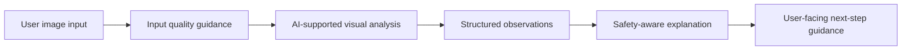
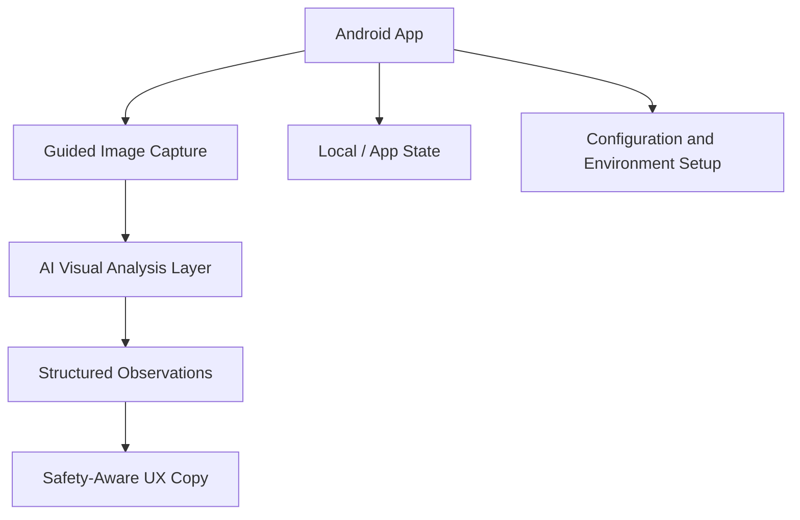

# Derm-Ai V1

> Exploratory AI prototype for skin-analysis user experience, visual input handling, and safety-first product design.

Derm-Ai V1 is a product prototype exploring how AI-assisted visual analysis can be presented to users in a responsible, understandable, and controlled way.

This project is not positioned as a medical diagnosis tool. The focus is product thinking: how sensitive AI outputs should be framed, how user trust should be protected, and how a mobile experience can guide users without overstating certainty.

---

## Product Snapshot

| Area | What Derm-Ai V1 Explores |
|---|---|
| Visual input | Capturing and preparing user-provided images for AI-supported analysis |
| User guidance | Helping users understand what kind of photo/input is suitable |
| AI interpretation | Presenting AI-generated observations with careful language |
| Safety boundaries | Avoiding diagnostic certainty and keeping outputs informational |
| Mobile UX | Designing a focused Android experience for sensitive AI interactions |
| Trust design | Making uncertainty, limitations, and next steps visible |

---

## Why It Matters

AI products in sensitive domains need more than model capability.

They need careful product boundaries, understandable outputs, and user experiences that do not create false confidence. In health-related contexts especially, speed and automation are not enough. The product must communicate uncertainty clearly and avoid replacing professional judgment.

Derm-Ai V1 explores that product challenge through a mobile prototype.

---

## Product Flow

---

## Responsible AI Design

| Product Risk | Design Response |
|---|---|
| User treats output as diagnosis | Use informational language and avoid diagnostic certainty |
| Poor image quality affects result | Add input guidance and suitability checks |
| AI output appears too authoritative | Show observations, confidence boundaries, and limitations |
| Sensitive user context is misunderstood | Keep human/professional judgment central |
| Over-automation weakens trust | Design AI as a support layer, not a final authority |

---

## Core Capabilities

| Capability | Product Value |
|---|---|
| Mobile-first experience | Tests how sensitive AI interactions work on Android |
| Image suitability checks | Reduces friction and improves input quality |
| Structured analysis output | Converts AI response into more readable user-facing signals |
| Safety-oriented copy | Keeps the experience cautious and responsible |
| Persistent analysis state | Supports continuity in user review flows |
| Brand and UI system work | Explores visual clarity for a health-adjacent AI product |

---

## My Role / Product Perspective

This project reflects my interest in AI products where user experience, trust, and safety are as important as technical capability.

Key product questions behind Derm-Ai V1:

| Product Question | Design Direction |
|---|---|
| How should AI outputs be shown in sensitive domains? | Use cautious, structured, and non-diagnostic language |
| How can users understand input quality requirements? | Guide image capture before analysis |
| How can uncertainty be communicated clearly? | Make limitations part of the user experience |
| How can AI support without replacing experts? | Position outputs as observations, not final decisions |
| How can mobile UX reduce confusion? | Keep flows focused, visual, and action-oriented |

---

## Architecture Overview

---

## Technology

| Layer | Stack |
|---|---|
| Platform | Android |
| Language | Kotlin |
| Build | Gradle / Kotlin DSL |
| Product Layer | Mobile UX flows, image handling, structured analysis views |
| AI Layer | Visual analysis workflow integration |
| Safety Layer | Input suitability checks and cautious output framing |

---

## Current Status

Exploratory public prototype and portfolio project.

Derm-Ai V1 is useful as a showcase for AI product thinking in sensitive contexts: trust, safety boundaries, mobile UX, and human-centered presentation of model outputs.

---

## Portfolio Context

Derm-Ai V1 is part of my broader product focus around:

- AI-supported product experiences,
- responsible AI UX,
- human-in-the-loop product design,
- decision-support systems,
- turning model outputs into understandable user experiences.
